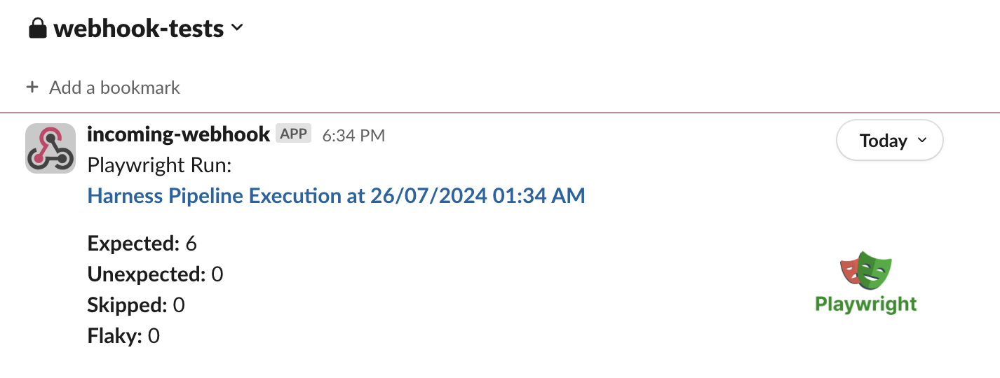

A sample pipeline running the full tutorial can be found here:
https://github.com/tuffacton/harness-playground/blob/main/.harness/CI_Webhook.yaml

# Example Workflow

We will simulate a scenario where Platform engineers will ultimately want to visualize some test outputs from the [Playwright web testing library](https://playwright.dev/).

We can use a relatively simple Run Step to run the default playwright tests:
```bash
- step:
    type: Run
    name: Playwright JSON
    identifier: Playwright_JSON
    spec:
    connectorRef: Nic_Docker_Harness_Cloud
    image: mcr.microsoft.com/playwright:v1.45.0-jammy
    shell: Bash
    command: |-
        # Install Node.js
        npm ci
        npx playwright test
```

The important thing to note for this specific exercise is that we will be saving the results of the default Playwright test to a JSON file that we will parse in downstream steps within the CI stage.

```ts title="playwright.config.ts
import { defineConfig } from '@playwright/test';

export default defineConfig({
  reporter: [['json', { outputFile: 'results.json' }]],
});
```

# Microsoft Teams Adaptive Cards
Microsoft Teams is growing in popularity as a collaboration tool for organizations, including their Platform and DevOps teams. Harness CI/CD pipelines can send detailed messages to MS Teams by taking advantage of Microsofts' Adaptive Cards UI format.

The simplest way to deploy them is with the [Incoming Webhook Microsoft Teams App](https://docs.microsoft.com/en-us/microsoftteams/platform/webhooks-and-connectors/how-to/add-incoming-webhook).

## Designing Adaptive Cards
There are a few methods to make it easier to prototype with Adaptive Cards.
1. Microsoft provides an [Adaptive Cards Designer](https://adaptivecards.io/designer/) that allows you to create and preview cards.
2. A Visual Studio Code extension called [Adaptive Cards](https://marketplace.visualstudio.com/items?itemName=harveyramer.adaptivecards) that allows you to create and preview cards.

## Adaptive Cards in Harness CI
Again, we can use a Run step with any container image that supports the `jq` tool to parse the JSON file that was generated by the Playwright test and save them to variables that can be used within the Adaptive Card.

```bash
# Extract results from previous tests
EXPECTED=$(jq -r '.stats.expected' /harness/test-results.json)
SKIPPED=$(jq -r '.stats.skipped' /harness/test-results.json)
UNEXPECTED=$(jq -r '.stats.unexpected' /harness/test-results.json)
FLAKY=$(jq -r '.stats.flaky' /harness/test-results.json)
# Save the date and time this step is approximately started
DATETIME=$(date "+%d/%m/%Y %I:%M %p")

# Send and Adaptive Card to MS Teams Webhook
curl -H 'Content-Type: application/json' -X POST <+variable.MS_Teams_Test_Webhook_URL> \
--data-binary @- << EOF
{
    "type": "AdaptiveCard",
    "body": [
        {
            "type": "TextBlock",
            "size": "Large",
            "weight": "Bolder",
            "text": "Harness CI - Playwright Test Results"
        },
        {
            "type": "ColumnSet",
            "columns": [
                {
                    "type": "Column",
                    "items": [
                        {
                            "type": "Image",
                            "url": "https://developer.harness.io/img/icon_ci.svg",
                            "altText": "Harness CI",
                            "size": "Small"
                        }
                    ],
                    "width": "auto"
                },
                {
                    "type": "Column",
                    "items": [
                        {
                            "type": "TextBlock",
                            "weight": "Bolder",
                            "text": "Harness CI",
                            "wrap": true
                        },
                        {
                            "type": "TextBlock",
                            "spacing": "None",
                            "text": "$DATETIME",
                            "isSubtle": true,
                            "wrap": true
                        }
                    ],
                    "width": "stretch"
                }
            ]
        },
        {
            "type": "TextBlock",
            "text": "Results from playwright toolset",
            "wrap": true
        },
        {
            "type": "FactSet",
            "facts": [
                {
                    "title": "Expected:",
                    "value": "$EXPECTED"
                },
                {
                    "title": "Skipped:",
                    "value": "$SKIPPED"
                },
                {
                    "title": "Unexpected:",
                    "value": "$UNEXPECTED"
                },
                {
                    "title": "Flaky:",
                    "value": "$FLAKY"
                }
            ]
        }
    ],
    "actions": [
        {
            "type": "Action.OpenUrl",
            "title": "View Pipeline Execution",
            "url": "<+pipeline.executionUrl>"
        }
    ],
    "$schema": "http://adaptivecards.io/schemas/adaptive-card.json",
    "version": "1.5"
}
EOF
```

Note that this assumes that you created a Harness [project-level variable](https://developer.harness.io/docs/platform/variables-and-expressions/add-a-variable/#define-variables) called `MS_Teams_Test_Webhook_URL` that contains the URL to your MS Teams webhook.

# Slack Block Kit
Slack also has a similar feature called [Block Kit](https://api.slack.com/block-kit) that allows you to create rich messages. The simplest way to deploy them is with the [Incoming Webhook Slack App](https://slack.com/apps/A0F7XDUAZ-incoming-webhooks?tab=more_info).

## Designing Slack Blocks
Unlike MS Teams, Slack only seems to have one helper tool called [Block Kit Builder](https://app.slack.com/block-kit-builder) that helps you to create and preview cards in a similar fashion to the Adaptive Card Designer.

## Slack Blocks in Harness CI
We can use effectively the same Run step, but with a different payload that renders a Slack block and sends it to a Slack webhook saved to the `Slack_Webhook` [project-level variable](https://developer.harness.io/docs/platform/variables-and-expressions/add-a-variable/#define-variables).

```bash
# Extract results from previous tests
EXPECTED=$(jq -r '.stats.expected' /harness/test-results.json)
SKIPPED=$(jq -r '.stats.skipped' /harness/test-results.json)
UNEXPECTED=$(jq -r '.stats.unexpected' /harness/test-results.json)
FLAKY=$(jq -r '.stats.flaky' /harness/test-results.json)
# Save the date and time this step is approximately started
DATETIME=$(date "+%d/%m/%Y %I:%M %p")

# Send and Adaptive Card to MS Teams Webhook
curl -H 'Content-Type: application/json' -X POST <+variable.Slack_Webhook> \
--data-binary @- << EOF
{
	"blocks": [
		{
			"type": "section",
			"text": {
				"type": "mrkdwn",
				"text": "Playwright Run:\n*<<+pipeline.executionUrl>|Harness Pipeline Execution at $DATETIME>*"
			}
		},
		{
			"type": "section",
			"text": {
				"type": "mrkdwn",
				"text": "*Expected:* $EXPECTED \n*Unexpected:* $UNEXPECTED \n*Skipped:* $SKIPPED \n*Flaky:* $FLAKY"
			},
			"accessory": {
				"type": "image",
				"image_url": "https://miro.medium.com/v2/resize:fit:953/0*w_ivMwMdr2YvH8bB.png",
				"alt_text": "Playwright Tests"
			}
		}
	]
}
EOF
```

We can then see the resulting rendered Slack Block in our Slack channel.
